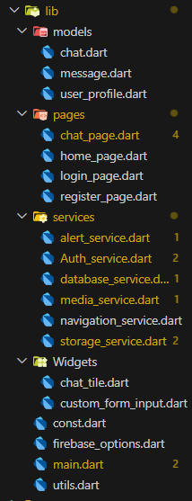

# 🚀 Flutter Real-time Chat App

[](https://flutter.dev/)
[](https://firebase.google.com/)
[](https://pub.dev/packages/get_it)
[](https://opensource.org/licenses/MIT)

A modern, secure, and blazing-fast real-time chat application developed with Flutter and Firebase. This project serves as a comprehensive example of building a robust messaging platform, integrating various Firebase services for backend operations and utilizing `get_it` for efficient dependency injection and state management.

---

## ✨ Features

* **Real-time Messaging:** Instant message delivery and updates using Firebase Firestore.
* **Image Sharing:** Seamlessly send and receive images within chats, leveraging Firebase Storage.
* **Secure Authentication:** User registration and login functionality implemented with Firebase Authentication (Email/Password).
* **User Management:** Store and retrieve user profiles from Firestore.
* **Clean Architecture:** Structured codebase using `get_it` for service location and dependency injection, promoting modularity and testability.
* **Responsive UI:** Built with Flutter's flexible UI framework, ensuring a smooth experience across various device sizes.
* **Device Preview (Optional):** Easy debugging and testing on different device layouts (can be toggled in `main.dart`).

---
## Demo

[](https://youtu.be/EBCLjdHe89w)


---

## 🛠️ Technologies Used

* **Frontend:** [Flutter](https://flutter.dev/)
* **Backend:** [Firebase](https://firebase.google.com/)
    * **Firestore:** NoSQL cloud database for real-time data storage.
    * **Authentication:** For user registration and login.
    * **Storage:** For storing and retrieving user-uploaded images.
* **State Management/Dependency Injection:** [GetIt](https://pub.dev/packages/get_it)
* **Chat UI Library:** [dash_chat_2](https://pub.dev/packages/dash_chat_2)

---

## 🚀 Getting Started

Follow these steps to get a local copy of the project up and running on your machine.

### Prerequisites

* [Flutter SDK](https://flutter.dev/docs/get-started/install) installed.
* [Firebase CLI](https://firebase.google.com/docs/cli) installed.
* A Firebase project set up in the Firebase Console.

### Installation

1.  **Clone the repository:**
    ```bash
    git clonehttps://github.com/TusharTalmale/chat-App-flutter.git
    cd chat-App-flutter
    ```

2.  **Install Flutter dependencies:**
    ```bash
    flutter pub get
    ```

3.  **Set up Firebase:**
    * Create a new Firebase project in the [Firebase Console](https://console.firebase.google.com/).
    * **Add your Android app:** Follow the instructions to register your Android app, download `google-services.json`, and place it in `android/app/`.
    * **Add your iOS app:** Follow the instructions to register your iOS app, download `GoogleService-Info.plist`, and place it in `ios/Runner/`.
    * Enable **Firestore**, **Authentication (Email/Password)**, and **Storage** in your Firebase project.
    * Set up **Firestore Security Rules** and **Storage Security Rules** appropriate for a chat application (e.g., allow read/write for authenticated users on chat data).

4.  **Run the app:**
    ```bash
    flutter run
    ```

---

## 📂 Project Structure


---

## 🤝 Contributing

Contributions are welcome! If you have suggestions for improvements or find any issues, please feel free to open an issue or submit a pull request.

1.  Fork the repository.
2.  Create your feature branch (`git checkout -b feature/AmazingFeature`).
3.  Commit your changes (`git commit -m 'Add some AmazingFeature'`).
4.  Push to the branch (`git push origin feature/AmazingFeature`).
5.  Open a Pull Request.

---

## 📄 License

Distributed under the MIT License. See `LICENSE` for more information.

---

## 📞 Contact

Your Name - [Tushar Talmale](https://www.linkedin.com/in/tushartalmale/) / tushartal2@gmail.com
